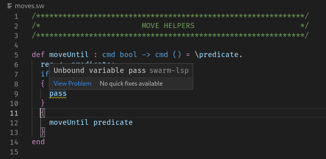

Swarm
=====

[![Build Status][build-status]][actions]
[![Contributor Covenant][badge-covenant]](CODE_OF_CONDUCT.md)
[![ircchat][badge-ircchat]][ircchat]
![GitHub Contributors][contribs]

[build-status]: https://github.com/swarm-game/swarm/actions/workflows/haskell-ci.yml/badge.svg
[actions]: https://github.com/swarm-game/swarm/actions
[badge-covenant]: https://img.shields.io/badge/Contributor%20Covenant-v2.0%20adopted-ff69b4.svg
[badge-ircchat]: https://img.shields.io/badge/chat-on%20libera-brightgreen.svg
[ircchat]: https://web.libera.chat/?channels=#swarm
[contribs]: https://contrib.rocks/image?repo=swarm-game/swarm

Swarm is a 2D programming and resource gathering game. Program your
robots to explore the world and collect resources, which in turn
allows you to build upgraded robots that can run more interesting and
complex programs.  Check out the [installation
instructions](https://github.com/swarm-game/swarm#installing) below,
join the [IRC channel](COMMUNITY.md), take a look at the
[wiki](https://github.com/swarm-game/swarm/wiki), or [see how you can
contribute](CONTRIBUTING.md)!


Features include:

* Practically infinite 2D procedurally generated worlds
* Simple yet powerful programming language based on the polymorphic
  lambda calculus + recursion, with a command monad for describing
  first-class imperative actions
* Editor support with LSP and highlighting
* In-game tutorial
* Multiple game modes:
    - In Classic mode, you start with the ability to produce only very
      basic, limited robots; collecting resources allows you to
      bootstrap your way into programming more sophisticated robots
      that can explore more of the world, collect more resources, etc.
    - Creative mode places no restrictions: program robots to your
      heart's content using whatever language features you want,
      without worrying about collecting resources.
    - There are also challenge scenarios where you attempt to program
      robots in order to solve pre-designed puzzles or challenges.

Installing
==========

**NOTE**: Swarm requires a POSIX-style terminal environment that
supports `terminfo`.  Linux and MacOS should work out of the box.  On
Windows, you will need to use [Windows Subsystem for
Linux](https://learn.microsoft.com/en-us/windows/wsl/); you should
then be able to follow instructions for installing on Linux.

It is recommended that you use a relatively large terminal window
(*e.g.* 170 columns x 40 rows or larger).  To find out the size of
your terminal, you can type `stty size` at a command prompt. If it's
not big enough, try decreasing the font size. You can read about
and/or share recommended terminal settings in [this GitHub
issue](https://github.com/swarm-game/swarm/issues/447).

- [Installing via binaries](#installing-via-binaries)
- [Installing from Hackage](#installing-from-Hackage)
- [Installing from source](#installing-from-source)

Installing via binaries
-----------------------

You can download the `swarm` binary and compressed data directory from
the [latest release](https://github.com/swarm-game/swarm/releases). If
you want to run the binary simply as `swarm`, you have to put it in
your `PATH`:
```bash
chmod +x ./swarm          # make it executable
echo $PATH | tr ':' '\n'  # choose one of the listed directories
mv ./swarm /my/chosen/bin/directory/
```
You will also need to extract the data to your local Swarm folder:
```bash
mkdir -p ~/.local/share/swarm/
unzip data.zip -d ~/.local/share/swarm
```

Installing from Hackage
-----------------------

If you can't use the provided binaries, or prefer installing from
Hackage, you should be able to install [from
Hackage](https://hackage.haskell.org/package/swarm) with

    cabal install swarm

If you don't already have the `cabal` tool, first [install
`ghcup`](https://www.haskell.org/ghcup/), then run `ghcup install
cabal` (if `cabal` was not automatically downloaded as part of
`ghcup`'s installation).

Installing from source
----------------------

If you want the latest unreleased bleeding-edge features, or want to
contribute to Swarm development, you can build from source.

1. Clone the Swarm repository, e.g.

       git clone https://github.com/swarm-game/swarm.git

1. If you don't already have the `stack` tool:
    1. Get the [`ghcup` tool](https://www.haskell.org/ghcup/), a handy
       one-stop utility for managing all the different pieces of a
       Haskell toolchain.
    1. Use `ghcup` to install `stack`:

           ghcup install stack

1. Now use `stack` to build and run Swarm:

       cd /path/to/the/swarm/repo
       stack run

1. Go get a snack while `stack` downloads a Haskell compiler and
   all of Swarm's dependencies.


Configuring your editor
=======================

Although you can write commands and definitions directly in the Swarm
REPL, once you get beyond the basics you'll probably want to use an
external editor for writing Swarm programs.  Swarm has support for
external editors with highlighting and LSP integration:



See the `editors` folder for details on how to configure your editor.
Currently, emacs and VS Code are officially supported, but more can be
added.

Community
=========

Check out the [COMMUNITY](COMMUNITY.md) page for ways to connect with
others in the community.

If you want to contribute, you're most welcome!  There are *lots* of
ways to contribute, regardless of your Haskell background.  For
example, even someone with no Haskell experience whatsoever could
still help with *e.g.* game design, playtesting, and creating
challenges and scenarios.  Check out the [CONTRIBUTING](CONTRIBUTING.md)
file for more specific information about how to contribute.
