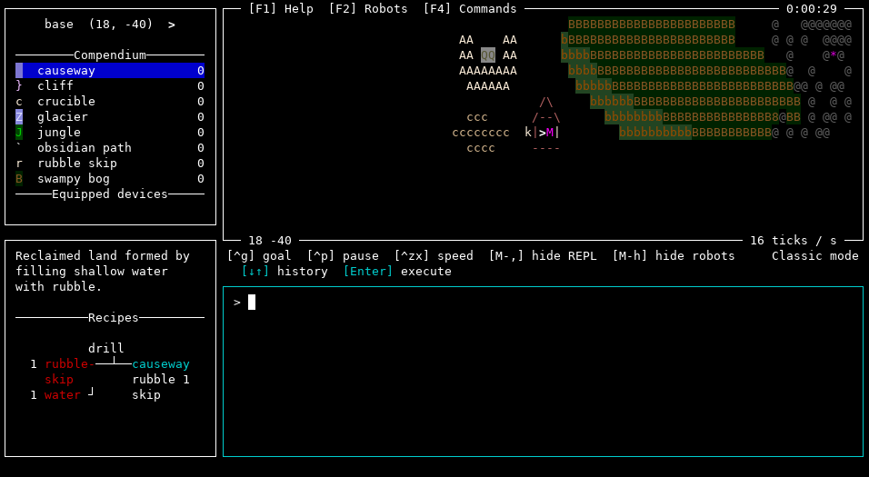

    [BLOpts]
    profile = wp
    tags = Swarm, game, robot, programming, resource
    categories = Haskell, projects

The [Swarm](https://github.com/swarm-game/swarm/) development team is
very proud to announce the latest release of the game.  This should
still be considered a development/preview release---you still can't
[save your games](https://github.com/swarm-game/swarm/issues/50)---but
it's made some remarkable progress and there are lots of fun things to
try.

What is it?
-----------

As a reminder, Swarm is a 2D, open-world programming and resource
gathering game with a strongly-typed, functional programming language
and a unique upgrade system. Unlocking language features is tied to
collecting resources, making it an interesting challenge to bootstrap
your way into the use of the full language.  It has also become a
flexible and powerful platform for constructing programming challenges.

A few of the most significant new features are highlighted below; for
full details, see the [release
notes](https://github.com/swarm-game/swarm/releases/tag/0.4.0.0).  If
you just want to try it out, see the [installation
instructions][install].

Expanded design possibilities
-----------------------------

The default play mode is the open-world, resource-gathering
scenario---but Swarm also supports "challenge scenarios", where you
have to complete one or more specific objectives with given resources
on a custom map.  There are currently 58 scenarios and counting---some
are silly proofs of concept, but many are quite fun and challenging!
I especially recommend checking out the `Ranching` and `Sokoban`
scenarios, as well as `A Frivolous Excursion` (pictured below).  And
creating new scenarios is a great way you can contribute to Swarm even
if you don't know Haskell, or aren't comfortable hacking on the
codebase.

Recently, a large amount of work has gone into expanding the
possibilities for scenario design:

- [Structure templates](https://github.com/swarm-game/swarm/pull/1332)
  allow you to design map tiles and then reuse them multiple times
  within a scenario.
- [Waypoints and
  portals](https://github.com/swarm-game/swarm/pull/1356) provide a
  mechanism for automatically navigating and teleporting around the
  world.
- Scenarios can have multiple
  [subworlds](https://github.com/swarm-game/swarm/pull/1353) besides
  the main "overworld", connected by portals.  For example you could
  go "into a building" and have a separate map for the building
  interior.
- There are a slew of new robot commands, many to do with different sensing
  modalities: `stride`, `detect`, `sniff`, `chirp,` `resonate`,
  `watch`, `surveil`, `scout`, `instant`, `push`, `density`, `use`,
  `halt`, and `backup`.
- A [new domain-specific
  language](https://github.com/swarm-game/swarm/pull/1376) for
  describing procedurally generated worlds.  The default procedurally
  generated world used to be hardcoded, but now it is described
  externally via the new DSL, and you can design your own procedurally
  generated worlds without editing the Swarm source code.
- The [key input
  handler](https://github.com/swarm-game/swarm/pull/1214) feature
  allows you to program robots to respond to keyboard input, so you
  can *e.g.* drive them around manually, or interactively trigger more
  complex behaviors.  This makes it possible to design "arcade-style"
  challenges, where the player needs to guide a robot and react to
  obstacles in real time---but they get to program the robot to respond
  to their commands first!
- A new prototype [integrated world
  editor](https://github.com/swarm-game/swarm/pull/873) lets you
  design worlds interactively.

UI improvements
---------------

In the past, entity and goal descriptions were simply plain text;
recently, we switched to actually parsing Markdown.  Partly, this is
just to make things look nice, since we can highlight code snippets,
entity names, etc.:

But it also means that we can now validate all code examples and
entity names, and even test that the tutorial is pedagogically sound:
any command used in a tutorial solution must be mentioned in a previous
tutorial, or else our CI fails!

There are also a number of other small UI enhancements, such as
improved type error messages, inventory search, and a collapsible REPL
panel, among others.

Scoring metrics
---------------

We now keep track of a number of metrics related to challenge scenario
solutions, such as total time, total game ticks, and code size.  These
metrics are tracked and saved across runs, so you can compete with
yourself, and with others.  For now, see these wiki pages:

* [Swarm speedrunning](https://github.com/swarm-game/swarm/wiki/Speedrunning)
* [Swarm code golf](https://github.com/swarm-game/swarm/wiki/Code-golf)

In the future, perhaps there will eventually be some kind of [social
website](https://github.com/swarm-game/swarm/issues/1259) with
leaderboards and user-uploaded scenarios.

Debugging
---------

Last but not least, we now have an [integrated single-stepping and
debugging mode](https://github.com/swarm-game/swarm/pull/1081)
(enabled by the `tweezers` device).

Give it a try!
--------------

To install, check out the [installation instructions][install]: you
can download a [binary release][release] (for now, Linux only, but
MacOS binaries should be on the horizon), or [install from
Hackage][hackage].  Give it a try and send us your feedback, either
[via a github issue][issue] or [IRC][irc]!

[install]: https://github.com/swarm-game/swarm#installing
[release]: https://github.com/swarm-game/swarm/releases
[hackage]: https://hackage.haskell.org/package/swarm
[issue]: https://github.com/swarm-game/swarm/issues/new/choose

Future plans & getting involved
-------------------------------

We're still hard at work on the game.  Fun upcoming things include:

- [Saving and loading games][saving]
- New world features like aliens and [cities][cities]
- New language features like [recursive types][rectypes],
  [arrays][arrays], [inter-robot communication][robot-comm], and [a
  proper `import` construct][import]

[cities]: https://github.com/swarm-game/swarm/issues/112
[saving]: https://github.com/swarm-game/swarm/issues/50
[rectypes]: https://github.com/swarm-game/swarm/issues/154
[arrays]: https://github.com/swarm-game/swarm/issues/98
[robot-comm]: https://github.com/swarm-game/swarm/issues/94
[import]: https://github.com/swarm-game/swarm/issues/495

Of course, there are also [tons of small things that need fixing and
polishing][low-hanging] too!  If you're interested in getting
involved, check out our [contribution guide][contrib], come [join us
on IRC][irc] (`#swarm` on Libera.Chat), or take a look at the list of
[issues marked "low-hanging fruit"][low-hanging].

[contrib]: https://github.com/swarm-game/swarm/blob/main/CONTRIBUTING.md
[low-hanging]: https://github.com/swarm-game/swarm/issues?q=is%3Aissue+is%3Aopen+label%3A%22C-Low+Hanging+Fruit%22
[irc]: https://web.libera.chat/?channels=#swarm

Brought to you by the Swarm development team:

- Brent Yorgey
- Karl Ostmo
- Ondřej Šebek

With contributions from:

- Alexander Block
- Brian Wignall
- Chris Casinghino
- Daniel Díaz Carrete
- Huw Campbell
- Ishan Bhanuka
- Jacob
- Jens Petersen
- José Rafael Vieira
- Joshua Price
- lsmor
- Noah Yorgey
- Norbert Dzikowski
- Paul Brauner
- Ryan Yates
- Sam Tay
- Steven Garcia
- Tamas Zsar
- Tristan de Cacqueray
- Valentin Golev

...not to mention many others who gave valuable suggestions and
feedback.  Want to see your name listed here in the next release?
[See how you can contribute!][contrib]
